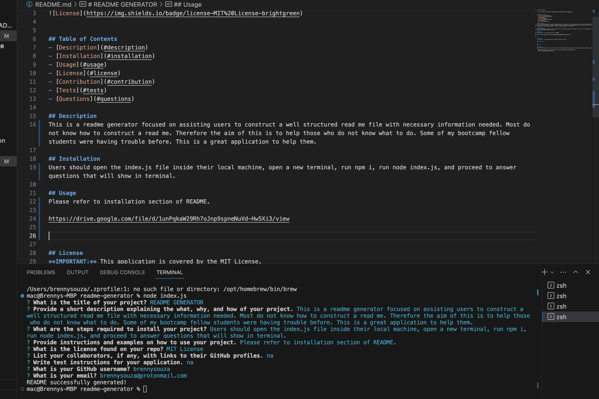

# README GENERATOR

## Table of Contents 
- [Description](#description)
- [Installation](#installation)
- [Usage](#usage)
- [License](#license)
- [Contribution](#contribution)
- [Tests](#tests)
- [Questions](#questions)

## Description 
This is a readme generator focused on assisting users to construct a well structured read me file with necessary information needed. Most do not know how to construct a read me. Therefore the aim of this is to help those who do not know what to do. Some of my bootcamp fellow students were having trouble before. This is a great application to help them.

## Installation
Users should open the index.js file inside their local machine, open a new terminal, run npm i, run node index.js, and proceed to answer questions that will show in terminal.

## Usage
Please refer to installation section of README.

Link to repo: https://github.com/brennysouza/readme-generator

## License
**IMPORTANT:** This application is covered by the MIT License.

## Contribution
na

## Tests
na

## Questions
Feel free to reach me at any time by these two contact methods below should you have any additional questions, comments, or concerns!

- GitHub Username: [brennysouza](https://github.com/brennysouza/readme-generator)
- Email: brennysouza@protonmail.com 

